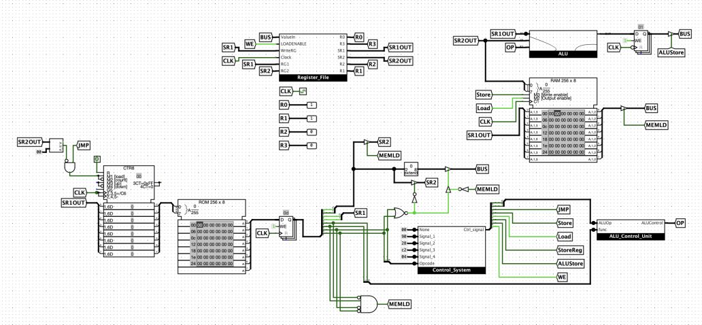
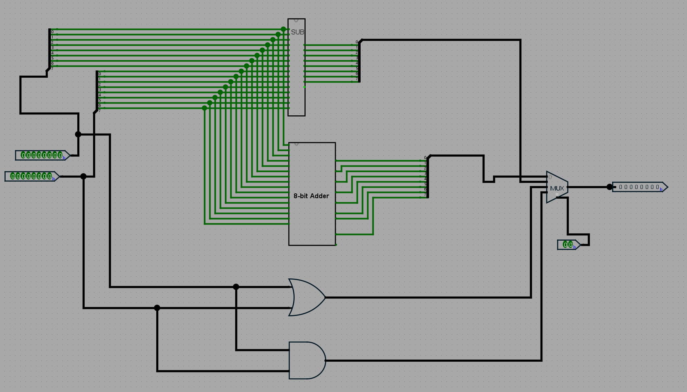
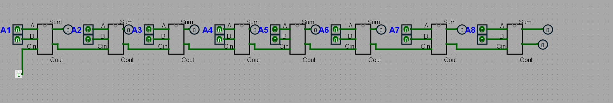
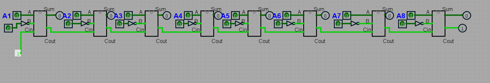
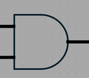
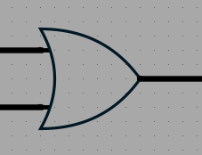

<h1 align="center"> 8-bit CPU | Logisim</h1>
<h1 align="ce" style="font-family: Arial, sans-serif; font-size: 20px; color: lightblue;">
  Aatir Bhatti | Joel Jardines | Luis Lopez
</h1>

  

<h1 align="left" style="font-family: Arial, sans-serif; font-size: 20px; color: lightgreen;">
  Features
</h1>

- 8-bit data width  
- Custom instruction set  
- 4 General Purpose Registers  
- Control Unit to synthesize control signals
- ALU supporting arithmetic & logic operations  
- ROM-based instruction memory  
- RAM for data storage  

<h1 align="left" style="font-family: Arial, sans-serif; font-size: 20px; color: lightgreen;">
  Opcode
</h1>

| Instruction Type | Opcode |
| :--------------: | :----: |
|       LOAD       |   00   |
|       STORE      |   01   |
|      R-type      |   10   |
|      JUMP      |   11   |

<h1 align="left" style="font-family: Arial, sans-serif; font-size: 20px; color: lightgreen;">
  Control Unit
</h1>

 

  

- The Control Unit decodes the instruction given from the instruction register, then it sends a digital signal controlling different functions of the CPU. 

| Opcode | WriteEnable | ALUStore | StoreReg | MemRead (load) | MemWrite (store) | JMP | ALUOp | HEX    |
|:------:|:--:|:--------:|:--------:|:--------------:|:----------------:|:---:|:-----:|:------:|
| 00     | 1  | 0        | 0        | 1              | 0                | 0   | 00    | 0x090  |
| 01     | 0  | 0        | 1        | 0              | 1                | 0   | 00    | 0x128  |
| 10     | 1  | 1        | 0        | 0              | 0                | 0   | 10    | 0x2E2  |
| 11     | 0  | 0        | 0        | 0              | 0                | 1   | 00    | 0x304  |

| Opcode | Control Signal HEX  |
|:------:|:-------------------------------------:|
| 00     | 0x90                                 |
| 01     | 0x28                                 |
| 10     | 0xE2                                 |
| 11     | 0x04                                 |
- 
<h1 align="left" style="font-family: Arial, sans-serif; font-size: 20px; color: lightgreen;">
  Arithmetic Logic Unit
</h1>

  

- **ADD (`00`)**  
  Performs unsigned addition.
  

  

- **SUB (`01`)**  
  Implements `A + (~B + 1)`. 

  

  

- **AND (`10`)**  
  Bit-wise logical AND. 

 

  

- **OR (`11`)**  
  Bit-wise logical OR. 

 

  

  

## Registers
- Four Registers using rising edge trigger
- Destination register is set to always be the 2nd and 3rd bits for all intructions
 

  

<h1 align="left" style="font-family: Arial, sans-serif; font-size: 20px; color: lightgreen;">
  Arithmetic Control Unit
</h1>

  

  

- The 2 bits referred as ALUOp from the control signal and the function bits determined the arithmetic operation the ALU will do.

- ALU Control Table:

| ALUOp | funct | ALUControl | Operation | Instruction Type |
|:-----:|:-----:|:----------:|:---------:|:----------------:|
| 00    |   -   |     -      |     -     |       -          |
| 01    |   -   |     -      |     -     |       -          |
| 10    |  00   |    00      | ADD       | R-Type (ADD)     |
| 10    |  01   |    01      | SUB       | R-Type (SUB)     |
| 10    |  10   |    10      | AND       | R-Type (AND)     |
| 10    |  11   |    11      | OR        | R-Type (OR)      |

<h1 align="left" style="font-family: Arial, sans-serif; font-size: 20px; color: lightgreen;">
  Operations Overview
</h1>

- **LOAD R2 <- Value from Register**
- LD R2, 1   value 1 gets loaded into R2

| Bits | Field Name                        | Binary |   Meaning         |
|------|-----------------------------------|--------|-------------------|
| 7–6  | **Opcode**                        | `00`   |   LOAD          |
| 5–4  | **Function**                      | `00`   |    N/A            |
| 3–2  | **Destination/Source Register1**  | `10`   |    R2             |
| 1–0  | **2 bit value**                   | `01`   |    1              |

- **LOAD R2 <- Value from Memory**
- LD R2 R1   value at memery address R1 goes into R2   R2 <- mem[R1]

| Bits | Field Name                        | Binary |   Meaning         |
|------|-----------------------------------|--------|-------------------|
| 7–6  | **Opcode**                        | `00`   |   LOAD            |
| 5–4  | **Function**                      | `01`   |    N/A            |
| 3–2  | **Destination/Source Register1**  | `10`   |    R2             |
| 1–0  | **Source Register2**              | `11`   |    R1             |

- **Store R2 R3**
- Value in R2 gets store into memory location in R3

| Bits | Field Name                        | Binary |   Meaning         |
|------|-----------------------------------|--------|-------------------|
| 7–6  | **Opcode**                        | `01`   |   STORE           |
| 5–4  | **Function**                      | `00`   |    N/A            |
| 3–2  | **Destination/Source Register1**  | `10`   |    R2             |
| 1–0  | **Source Register2**              | `11`   |    R3             |

- **ADD R2 R3**

| Bits | Field Name                        | Binary |   Meaning         |
|------|-----------------------------------|--------|-------------------|
| 7–6  | **Opcode**                        | `10`   |   R-type          |
| 5–4  | **Function**                      | `00`   |    ADD            |
| 3–2  | **Destination/Source Register1**  | `10`   |    R2             |
| 1–0  | **Source Register2**              | `11`   |    R3             |

- **SUB R2 R3**

| Bits | Field Name                        | Binary |   Meaning         |
|------|-----------------------------------|--------|-------------------|
| 7–6  | **Opcode**                        | `10`   |   R-type          |
| 5–4  | **Function**                      | `01`   |    SUB            |
| 3–2  | **Destination/Source Register1**  | `10`   |    R2             |
| 1–0  | **Source Register2**              | `11`   |    R3             |

- **AND R2 R3**

| Bits | Field Name                        | Binary |   Meaning         |
|------|-----------------------------------|--------|-------------------|
| 7–6  | **Opcode**                        | `10`   |   R-type          |
| 5–4  | **Function**                      | `10`   |    AND            |
| 3–2  | **Destination/Source Register1**  | `10`   |    R2             |
| 1–0  | **Source Register2**              | `11`   |    R3             |

- **OR R2 R3**

| Bits | Field Name                        | Binary |   Meaning         |
|------|-----------------------------------|--------|-------------------|
| 7–6  | **Opcode**                        | `10`   |   R-type          |
| 5–4  | **Function**                      | `11`   |    OR            |
| 3–2  | **Destination/Source Register1**  | `10`   |    R2             |
| 1–0  | **Source Register2**              | `11`   |    R3             |

- **JUMP R2 R3**
- Moves the PC counter to the value stored in R2 when R3 is non-zero
- Intruction does nothing if value in R3 is zero.
- Acts like a for-loop where the value in R3 can be used as number of iterations, and within the jump address you can decrement the value in R3

| Bits | Field Name                        | Binary |   Meaning         |
|------|-----------------------------------|--------|-------------------|
| 7–6  | **Opcode**                        | `11`   |   JUMP          |
| 5–4  | **Function**                      | `00`   |    N/A            |
| 3–2  | **Destination/Source Register1**  | `10`   |    R2             |
| 1–0  | **Source Register2**              | `11`   |    R3             |

<h1 align="left" style="font-family: Arial, sans-serif; font-size: 20px; color: lightgreen;">
  Testing the CPU 
</h1>

  

  

